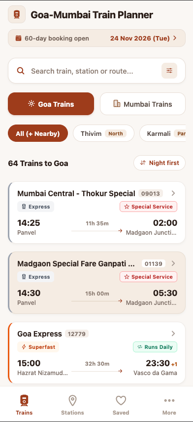
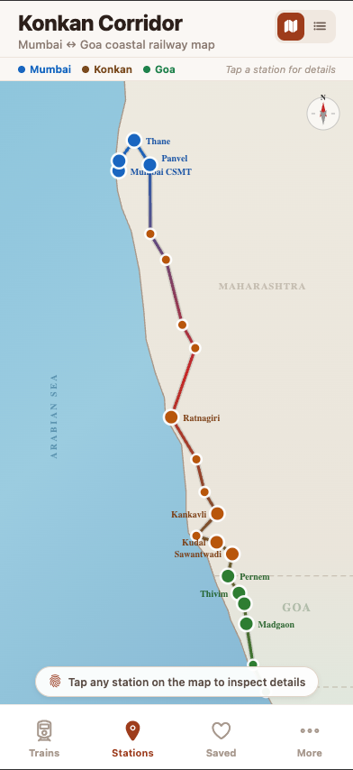
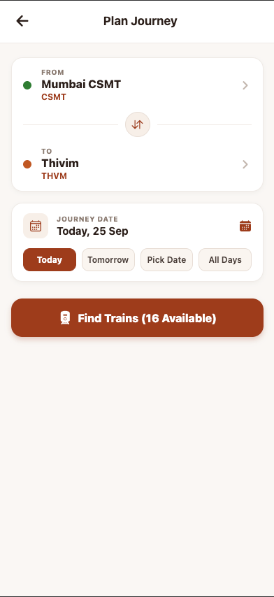

# Goa-Mumbai Train Planner (Goa Rail Map) 🚆🌴

A modern, fast, and intuitive React Native & Expo application designed for travelers on the scenic Konkan Railway corridor between Mumbai and Goa. Track schedules, plan journeys, inspect stations, and view the coastal railway route map seamlessly.

---

## 📱 Screenshots

<p align="center">
  
  &nbsp;
  
  &nbsp;
  
</p>

| Train Planner | Konkan Corridor Map | Plan Journey |
| :---: | :---: | :---: |
| Browse trains between Mumbai & Goa, 60-day advance booking window, and service status | Interactive coastal railway corridor map from Mumbai CSMT down to Madgaon & Vasco | Custom point-to-point journey search with date pickers and real-time train availability |

---

## ✨ Features

- 🚆 **Comprehensive Train Schedules**: Real-time schedules, timings, running days, and train classes for trains operating across the Konkan route.
- 🗺️ **Interactive Konkan Corridor Map**: Visual representation of the coastal railway network spanning Mumbai, Konkan, and Goa stations.
- 📅 **Advance Booking Calendar**: Track 60-day advance reservation windows and Indian holiday dates.
- 🔍 **Route & Journey Planner**: Filter by origin, destination, journey dates, and special holiday/seasonal trains.
- 📍 **Station Directory**: Detailed station info for major hubs like Mumbai CSMT, Thane, Panvel, Ratnagiri, Thivim, Karmali, Madgaon, and Vasco da Gama.
- ❤️ **Saved Trains**: Save frequent trains and routes for quick offline access.
- 🔔 **Booking Alerts**: Automated reminders for upcoming train ticket bookings.

---

## 🛠️ Tech Stack

- **Framework**: [Expo](https://expo.dev/) (SDK 57) with [React Native](https://reactnative.dev/)
- **Language**: [TypeScript](https://www.typescriptlang.org/)
- **Navigation**: [React Navigation](https://reactnavigation.org/) (Stack & Bottom Tabs)
- **State Management**: [Zustand](https://github.com/pmndrs/zustand)
- **Backend & Sync**: Firebase & Cloud Firestore
- **Maps**: React Native Maps
- **Animations & Gestures**: React Native Reanimated & React Native Gesture Handler

---

## 🚀 Getting Started

### Prerequisites

- Node.js (v18 or higher recommended)
- npm or yarn
- [Expo Go](https://expo.dev/go) app on iOS / Android or Xcode / Android Studio simulator

### Installation

1. **Clone the repository:**
   ```bash
   git clone https://github.com/prashiln79/goaRailWay.git
   cd goaRailWay
   ```

2. **Install dependencies:**
   ```bash
   npm install
   ```

3. **Start the development server:**
   ```bash
   npx expo start
   ```

4. **Run on your device:**
   - Scan the QR code using the **Expo Go** app (Android) or the Camera app (iOS).
   - Press `a` in the terminal to launch the Android emulator.
   - Press `i` to launch the iOS simulator.
   - Press `w` to open in a web browser.

---

## 📂 Project Structure

```text
├── assets/                 # App assets, icons, and screenshots
│   └── screenshots/        # App preview screenshots for README
├── src/
│   ├── components/         # Reusable UI components
│   ├── config/             # App & Firebase configurations
│   ├── context/            # React context providers
│   ├── data/               # Static route and station datasets
│   ├── navigation/         # App navigation & Tab navigator
│   ├── screens/            # Core screens (Trains, Stations, Map, Saved, More)
│   ├── services/           # API services & sync utilities
│   ├── store/              # Zustand state stores
│   ├── types/              # TypeScript interfaces and types
│   └── utils/              # Helper functions
├── App.tsx                 # Root application component
└── app.json                # Expo application configuration
```

---

## 📄 License

This project is licensed under the terms specified in the [LICENSE](LICENSE) file.
